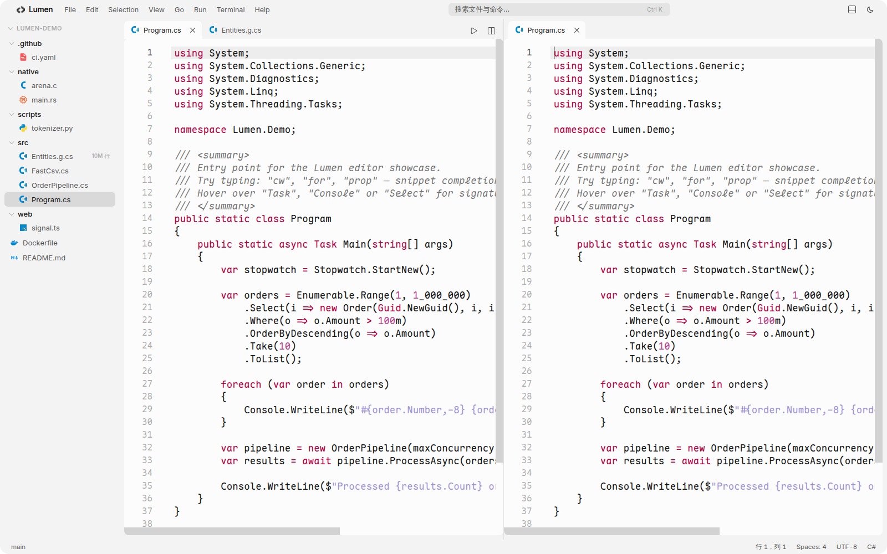
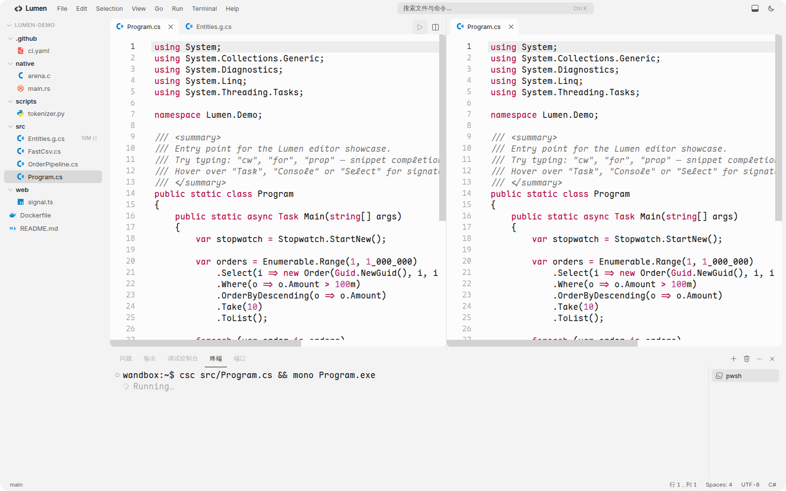

[![][image-banner]][demo-link]

Lumen is a fast, local-first code editor that runs entirely in your browser. Open any GitHub repository, browse and edit files with full syntax highlighting, run code right from the editor — no install, no server, nothing leaves your machine.

It ships with a Linear-style sync engine: the repository tree is snapshotted to IndexedDB for instant startup, remote changes are pulled in as incremental deltas and hot-applied to open files, and your commits go through a persistent offline-safe transaction queue that replays automatically when you're back online.

**[Live Demo][demo-link]** **[Report Issues][issues-link]**

[![][github-stars-shield]][stars-link]
[![][github-license-shield]][license-link]

> \[!WARNING]
> Lumen is still in **beta** — expect rough edges and the occasional bug. Actively being worked on.

## Features

- **GitHub sync engine** — branch head SHA as the sync version, IndexedDB local bootstrap, `compare` API deltas, conflict-aware three-way merge, offline transaction queue
- **Editing** — CodeMirror 6, 20+ languages, snippets, signature hints, 10M-line virtual scrolling
- **Run code** — execute C, C#, Python, Rust, and more via Wandbox, output in the built-in terminal
- **Split view** — drag any file from the explorer or a tab into either editor pane, lazy-loaded on drop
- **Branch switcher** — VS Code-style branch picker in the status bar, incremental branch checkout





## Quick Start

```bash
git clone https://github.com/shuakami/lumen-editor.git
cd lumen-editor
npm install
npm run dev
```

Or just open the [live demo][demo-link] — then `File → Open GitHub Repository` and paste any `owner/repo`.

> \[!NOTE]
> A personal access token (`ghp_…`) is only needed for private repositories or committing. It is stored in your browser's localStorage and never sent anywhere except api.github.com.

## License

[MIT][license-link]

<!-- LINK GROUP -->

[image-banner]: docs/images/banner.png
[demo-link]: https://shuakami.github.io/lumen-editor/
[issues-link]: https://github.com/shuakami/lumen-editor/issues
[stars-link]: https://github.com/shuakami/lumen-editor/stargazers
[license-link]: LICENSE
[github-stars-shield]: https://img.shields.io/github/stars/shuakami/lumen-editor?color=317cfe&labelColor=black&style=flat-square
[github-license-shield]: https://img.shields.io/badge/license-MIT-317cfe?labelColor=black&style=flat-square
