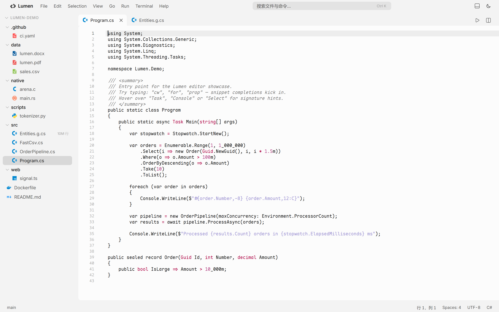
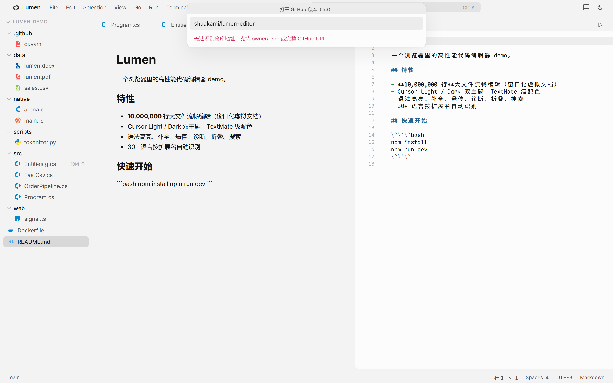
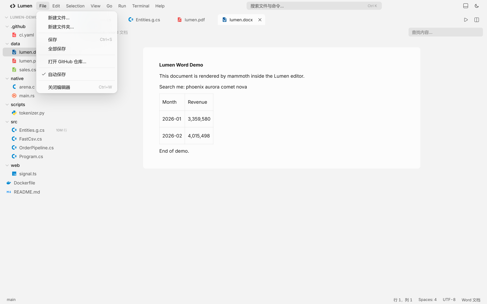
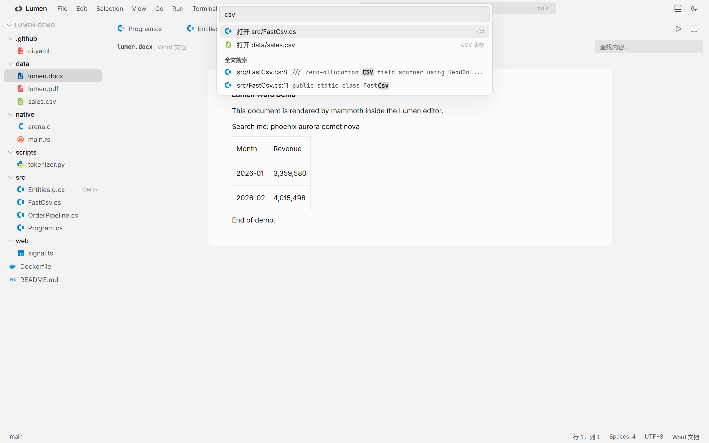
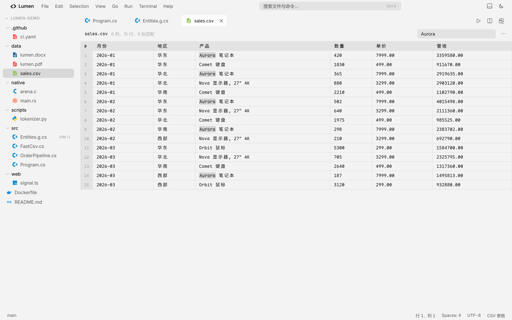
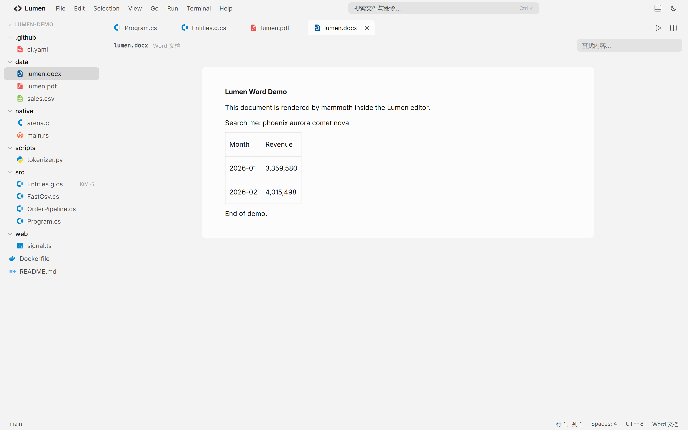
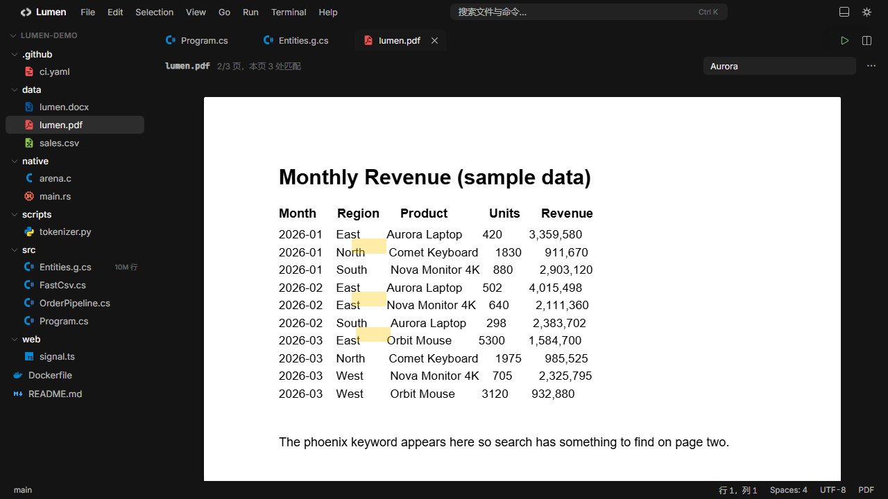
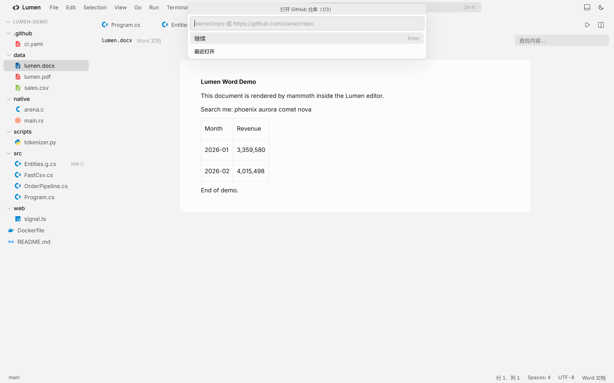
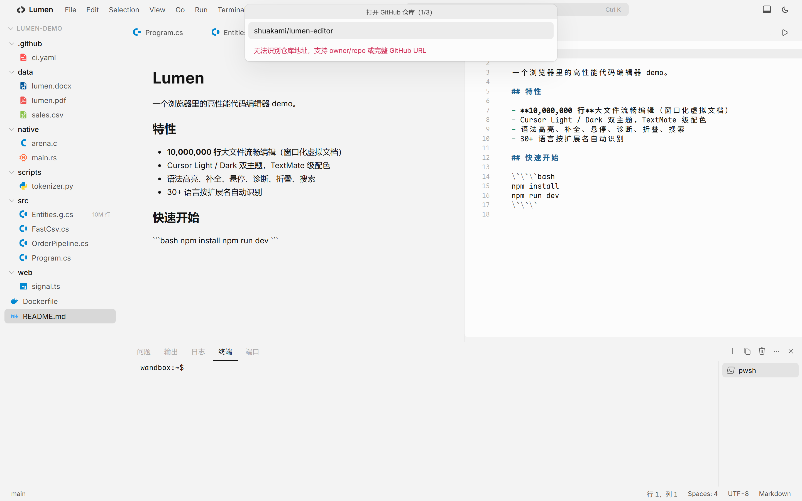

[![Banner][banner]][demo]

# Lumen — Local-First Code Editor in Your Browser

Lumen is a fast, local-first code editor that runs entirely in your browser. Open any GitHub repository, browse and edit files with full syntax highlighting, run code right from the editor — no install, no server, nothing leaves your machine.

It ships with a Linear-style sync engine: the repository tree is snapshotted to IndexedDB for instant startup, remote changes are pulled in as incremental deltas and hot-applied to open files, and your commits go through a persistent offline-safe transaction queue that replays automatically when you're back online.

[**Live Demo**][demo] · [Report Issues][issues]

> \[!WARNING]
> Lumen is still in **beta** — expect rough edges and the occasional bug. Actively being worked on.

---

## At a Glance



Dark theme, split panes, terminal and file viewer all visible at once.



---

## Editor

CodeMirror 6 with **30+ languages** out of the box (C, C#, C++, Rust, Python, TypeScript, Java, Go, Dockerfile, SQL, JSON, YAML, Markdown, …), TextMate-grade colors, signature hints, autocompletion, multi-cursor editing, folding, and 10M-line virtual scrolling.



`Ctrl+P` opens the command palette — fuzzy file and command search across the whole tree.



### Built-in Document Viewers

| Format | Renderer | Highlights |
| --- | --- | --- |
| Markdown | `marked` + DOMPurify | Live side-by-side preview, syntax highlight inside code blocks |
| CSV / TSV | Custom parser (quote-aware, delimiter sniff) | Cell search with hit highlighting, optional "only matched rows" filter |
| Word (`.docx`) | `mammoth` → semantic HTML | Text search across the rendered document |
| PDF | `pdfjs-dist` (custom integration) | Page navigation, search with viewport-space hit rectangles |







> All four viewers are lazy-loaded: the `docview` module (4 kB gzip) is fetched on first open, and the heavy libraries (`mammoth`, `pdfjs`) load only when you actually open a `.docx` or `.pdf`. **A user who never opens a document never pays for it.**

---

## GitHub Sync Engine

Open any repository directly from the editor — paste `owner/repo` or a full `https://github.com/owner/repo` URL into the picker, no token needed for public repos.



- **Branch HEAD as sync version** — every local snapshot is tagged with the SHA it was based on
- **Incremental deltas** via the `compare` API, hot-applied to open CodeMirror instances without disrupting the cursor
- **Offline-safe transaction queue** — commits made while disconnected are replayed in order when you come back online; a three-way merge against the new HEAD is automatic
- **Recent repos** — last 8 owner/repo@branch combinations, surfaced both in the GitHub picker and in `File → Recent`
- **My repositories** — once you've signed in with a personal access token, your own repos are listed with avatars and per-repo "load more" pagination

### Sync Layer (`lumenedit/sync`)

```ts
import { SyncEngine, repoKey } from "lumenedit/sync";

const engine = new SyncEngine(tree.ref, tree.headSha, {
  onDeltas:  (deltas, head) => console.log("remote changed", deltas),
  onTransactionDone:    (tx, r) => console.log("committed", tx.path, r.newSha),
  onTransactionError:   console.error,
  onState:              (state, pending) => console.log(state, pending),
});
await engine.start();
```

---

## Run Code In-Place

`Ctrl+Enter` sends the current file to [Wandbox](https://wandbox.org/) — C, C++, C#, Rust, Python, Go, Java, and friends. Output streams into the integrated terminal panel below the editor.


The terminal panel doubles as a logs view and a tabbed shell (`pwsh` / `bash` depending on platform) — toggle it from `Terminal → Toggle Console` or with the layout icon in the tab bar.



---

## Quick Start

```bash
git clone https://github.com/shuakami/lumen-editor.git
cd lumen-editor
npm install
npm run dev
```

Then open `http://localhost:5173`. The repo ships with a curated demo workspace — explore the file tree, open `data/sales.csv` for the table view, `data/lumen.pdf` and `data/lumen.docx` for the document viewers, `web/signal.ts` for syntax highlighting.

Or just open the [live demo][demo] — then `File → Open GitHub Repository` and paste any `owner/repo`.

> \[!NOTE]
> A personal access token (`ghp_…`) is only needed for private repositories or committing. It is stored in your browser's localStorage and never sent anywhere except `api.github.com`.

---

## Use as a Library

Lumen is also a reusable library: the editor component, GitHub layer, sync engine, local history and smart preloader can each be imported independently.

```bash
npm install lumenedit
```

Prefer the narrow entry point for production code so the editor and its language parsers are never downloaded by sync-only applications:

```tsx
import { Editor } from "lumenedit/editor";
import { openRepo, commitFile } from "lumenedit/github";
import { SyncEngine, loadLocalHistory } from "lumenedit/sync";
import { Preloader } from "lumenedit/preload";
```

The root entry remains available for compatibility and supports tree shaking:

```tsx
import {
  Editor,                      // CodeMirror 6 editor with doc cache / cursor restore / find panel
  openRepo, fetchBlob,         // GitHub API layer (pure functions)
  listCommits, commitFile,     // commit history + auto three-way-merge commits
  SyncEngine, repoKey,         // incremental sync engine with offline transaction queue
  loadLocalHistory,            // IndexedDB local edit history
  Preloader, brainScore,       // smart preloading with a learned open-model
} from "lumenedit";

const tree = await openRepo("shuakami", "lumen-editor");
```

```tsx
<Editor fileId="gh:src/index.ts" filename="index.ts" initialDoc={code} dark
        onDocChange={(id) => {/* persist draft */}} />
```

Peer dependencies: `react >= 18` and `react-dom >= 18`. The minified CodeMirror and Lezer runtime is compiled into Lumen; consumers do not install their source packages, documentation or source maps.

### Production Size

Measured from the packed npm artifact with esbuild code splitting; React is external to the editor benchmark:

| Import | Initial JS | gzip | Brotli | Initial chunks |
| --- | ---: | ---: | ---: | ---: |
| `lumenedit/sync` | 9.0 kB | 3.3 kB | 2.9 kB | 1 |
| `lumenedit` (`SyncEngine` only) | 9.5 kB | 3.7 kB | 3.2 kB | 2 |
| `lumenedit/editor` | 472.6 kB | 154.1 kB | 131.1 kB | 2; lazy languages excluded |

The npm tarball is about 710.1 kB and installs 2.2 MB across 152 package files. Lumen has no production dependency tree beyond the React peer dependencies supplied by the host application. All 126 minified editor/runtime chunks total 2.22 MB before transport compression; language parsers remain lazy and load only when used.

---

## Keyboard Shortcuts

| Action | Shortcut |
| --- | --- |
| Command palette | `Ctrl/⌘ + P` |
| Quick open file | `Ctrl/⌘ + K` |
| Run current file | `Ctrl/⌘ + Enter` |
| Save | `Ctrl/⌘ + S` |
| Toggle sidebar | `Ctrl/⌘ + B` |
| Split editor | `View → Split Editor` |
| Toggle terminal | `Ctrl/⌘ + \`` |
| New file | `Ctrl/⌘ + Alt + N` |

---

## License

[MIT](LICENSE)

[banner]: docs/images/banner.png
[demo]: https://shuakami.github.io/lumen-editor/
[issues]: https://github.com/shuakami/lumen-editor/issues